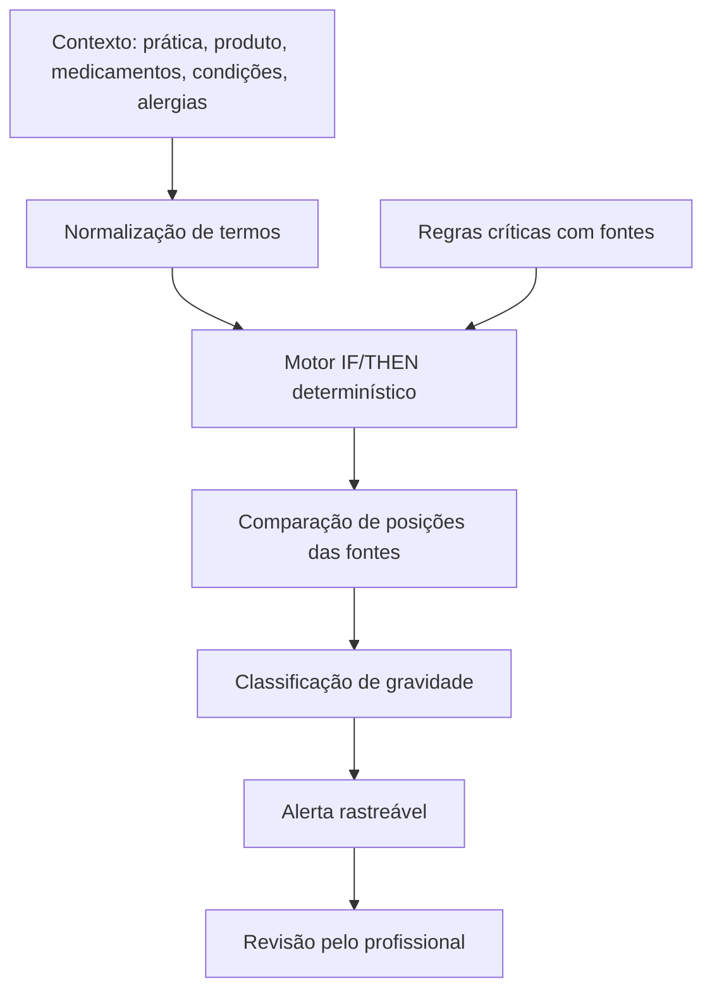

# Alertas de Segurança Determinísticos

## Objetivo

O mecanismo de alertas de segurança do Integrativo.App existe para sinalizar contraindicações graves, interações, sinais de alarme e divergências entre fontes públicas confiáveis. Ele funciona como apoio profissional e não substitui diagnóstico, prescrição, responsabilidade técnica, conselho profissional ou encaminhamento médico.

## Decisão Arquitetural

O sistema não usa IA decisória, modelo generativo, rede neural, rede bayesiana ou inferência probabilística para contraindicações graves.

A arquitetura adotada é um motor determinístico de regras IF/THEN, com:

- regras explícitas;
- fontes vinculadas;
- gravidade fixa;
- conduta conservadora;
- rastreabilidade por `regra_id`;
- ausência de linguagem de liberação clínica automática.

## Princípio de Segurança

Quando fontes divergem, prevalece a posição mais restritiva:

```txt
contraindicado > cautela > sem_mencao > permitido
```

Se uma fonte confiável aponta contraindicação e outra não menciona o risco, o sistema trata como divergência por omissão e mantém alerta.

## Fluxo



## Componentes

- `backend/servicos/alertas-seguranca.js`: regras, normalização, comparação de fontes e geração de alertas.
- `backend/rotas/alertas-seguranca.js`: endpoints de consulta.
- `backend/server.js`: registro da rota `/api/alertas-seguranca`.
- `frontend/painel-prescricao.html`: consulta automática antes da emissão de prescrição/recomendação.
- `frontend/painel-bibliotecas.html`: consulta de alertas durante busca profissional nas bibliotecas.
- `frontend/bibliotecas-especialidades.html`: consulta pública de alertas durante navegação no mapa de bibliotecas.

## Proteção do Arquivo de Regras

As regras ficam exclusivamente no backend, fora do diretório `frontend`, portanto não são empacotadas como JavaScript público do navegador.

O navegador não recebe o arquivo de regras. Ele chama uma função JavaScript local que envia o contexto para a API e recebe apenas o resultado da avaliação.

```txt
Frontend JS -> /api/alertas-seguranca/verificar -> motor backend -> alerta resumido
```

O endpoint administrativo `/api/alertas-seguranca/regras` exige usuário autenticado com perfil `admin` ou `super_admin`. Ele não deve ser usado em páginas públicas.

Observação: isso protege contra acesso web comum. Quem tiver acesso administrativo ao servidor, ao repositório ou ao ambiente de build ainda poderá ver os arquivos. Para sigilo maior, manter o repositório privado e restringir acesso ao servidor.

## Endpoints

| Método | Rota | Acesso | Uso |
|--------|------|--------|-----|
| GET | `/api/alertas-seguranca` | Público, JWT opcional | Consulta rápida por query string |
| POST | `/api/alertas-seguranca/verificar` | Público, JWT opcional | Consulta estruturada por JSON |
| GET | `/api/alertas-seguranca/regras` | `admin` ou `super_admin` | Auditoria das regras cadastradas |

### `GET /api/alertas-seguranca`

Consulta simples por termo, prática, produto, condições, medicamentos e alergias.

Exemplo:

```bash
curl "http://localhost:3001/api/alertas-seguranca?termo=ginkgo%20varfarina"
```

### `POST /api/alertas-seguranca/verificar`

Consulta estruturada para formulários profissionais, prescrições e recomendações.

Exemplo:

```bash
curl -X POST http://localhost:3001/api/alertas-seguranca/verificar \
  -H "Content-Type: application/json" \
  -d '{
    "pratica": "fitoterapia",
    "produto": "ginkgo",
    "medicamentos": ["varfarina"]
  }'
```

### `GET /api/alertas-seguranca/regras`

Lista regras cadastradas com gravidade e fontes, para auditoria. Restrito a `admin` e `super_admin`.

As rotas públicas usam JWT opcional apenas para registrar `usuario_id` na resposta e nos logs quando houver token válido. Token ausente ou inválido não bloqueia a verificação pública; o arquivo completo de regras continua protegido no backend e só é listado pela rota administrativa.

## Exemplo de Alerta

```json
{
  "regra_id": "FITOTERAPIA_ANTICOAGULANTE_001",
  "area": "Fitoterapia",
  "tipo": "interacao",
  "gravidade": "alta",
  "mensagem": "Possível aumento de risco de sangramento ou interação medicamentosa com fitoterápicos.",
  "conduta": "Não recomendar sem validação médica ou farmacêutica; checar medicação, dose, indicação e sinais de sangramento.",
  "fontes": [
    { "nome": "ANVISA", "posicao": "cautela" },
    { "nome": "WHO Monographs", "posicao": "cautela" },
    { "nome": "NCCIH", "posicao": "cautela" }
  ]
}
```

## Frase Padrão Sem Alerta

O sistema deve usar:

```txt
Nenhum alerta crítico encontrado nas regras cadastradas. Isso não significa liberação clínica automática.
```

O sistema não deve usar:

```txt
Está seguro.
```

## Manutenção

Novas regras devem ser adicionadas apenas quando houver fonte rastreável e texto de conduta conservadora. Alterações em gravidade ou conduta devem preservar o `regra_id` antigo em histórico documental ou criar novo identificador versionado.

## Gestão em Alfa e Produção

As regras são versionadas pelo Git junto com o backend. O ambiente alfa deve ser usado para validar regras antes de liberar para produção.

Fluxo recomendado:

1. Criar ou alterar regra em `backend/servicos/alertas-seguranca.js`.
2. Testar localmente com casos positivos e negativos.
3. Subir para `master`.
4. Confirmar primeiro no backend alfa:

```txt
https://integrativoappespelho.onrender.com/api/alertas-seguranca?termo=ginkgo%20varfarina
```

5. Conferir se `usa_ia:false`, `regra_id`, `gravidade`, `conduta` e `fontes` estão corretos.
6. Validar no painel profissional e na prescrição.
7. Só então considerar a regra apta para uso em produção.

O ambiente alfa pode usar banco separado, mas o arquivo de regras continua no backend e não deve ser copiado para o frontend.

## Critério para Nova Regra

Cada nova regra deve ter:

- `id` único e estável;
- `area`;
- `tipo`;
- `gravidade`;
- gatilhos explícitos (`pratica`, `condicoes`, `medicamentos` ou `alergias`);
- `mensagem`;
- `conduta`;
- pelo menos uma fonte rastreável;
- posição da fonte (`contraindicado`, `cautela`, `sem_mencao` ou `permitido`).
