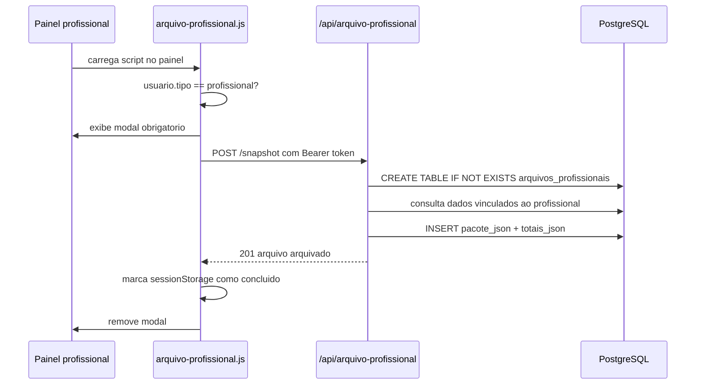

# Arquivo Profissional Central

## Objetivo

O arquivo profissional central cria um snapshot obrigatorio dos dados assistenciais vinculados ao profissional antes que ele continue usando ou saia de paineis profissionais. A intencao e manter rastreabilidade, continuidade operacional e uma copia central no servidor da plataforma.

Este fluxo nao substitui politica formal de retencao, exportacao LGPD, backup, prontuario legal ou auditoria externa. Esses pontos ainda precisam de regra operacional propria.

## Decisao Arquitetural

O snapshot e montado no backend a partir do usuario autenticado. O frontend apenas dispara a operacao e bloqueia saida/logout ate a sessao atual concluir o arquivamento.

```txt
Painel profissional -> modal obrigatorio -> POST /api/arquivo-profissional/snapshot -> arquivos_profissionais
```

## Fluxo



## Componentes

- `frontend/js/arquivo-profissional.js`: injeta modal, chama a API e bloqueia `beforeunload`/`logout` enquanto o snapshot da sessao nao foi concluido.
- Paineis que carregam o script:
  - `frontend/painel-terapeuta.html`
  - `frontend/painel-prescricao.html`
  - `frontend/painel-mensagens.html`
  - `frontend/painel-financeiro.html`
  - `frontend/painel-white-label.html`
  - `frontend/painel-recepcao.html`
  - `frontend/painel-rh.html`
  - `frontend/painel-revenda.html`
  - `frontend/painel-upa.html`
- `backend/rotas/arquivo-profissional.js`: monta o pacote, cria a tabela se necessario e grava snapshots.
- `backend/server.js`: registra a rota em `/api/arquivo-profissional`.

## Quando o Modal Aparece

O script chama `deveArquivar()` e exige snapshot quando:

- `localStorage.integra_usuario.tipo === "profissional"`;
- `sessionStorage.integrativo_arquivo_profissional_sessao_ok !== "true"`.

Depois de sucesso:

- `sessionStorage.integrativo_arquivo_profissional_sessao_ok` vira `true`;
- `localStorage.integrativo_arquivo_profissional_ultimo` recebe o horario ISO;
- o modal e removido apos uma pequena pausa visual.

Por usar `sessionStorage`, uma nova aba ou nova sessao de navegador pode exigir novo snapshot mesmo que `localStorage.integrativo_arquivo_profissional_ultimo` exista.

## Contrato da API

Todas as rotas exigem JWT da plataforma e tipo `profissional` ou `admin`.

### `POST /api/arquivo-profissional/snapshot`

Cria uma linha em `arquivos_profissionais`.

Resposta de sucesso:

```json
{
  "mensagem": "Dados do profissional arquivados no servidor central.",
  "arquivo": {
    "id": 10,
    "profissional_id": 123,
    "tipo": "snapshot-assistencial",
    "status": "arquivado",
    "totais_json": {
      "pacientes": 2,
      "agendamentos": 5,
      "prescricoes": 1,
      "pagamentos": 3,
      "tiss": 0,
      "fhir": 0
    },
    "criado_em": "2026-06-14T01:00:00.000Z"
  }
}
```

### `GET /api/arquivo-profissional/status`

Retorna o ultimo snapshot do profissional autenticado.

```json
{
  "obrigatorio": true,
  "ultimo_arquivo": {
    "id": 10,
    "tipo": "snapshot-assistencial",
    "status": "arquivado",
    "totais_json": {
      "pacientes": 2,
      "agendamentos": 5,
      "prescricoes": 1,
      "pagamentos": 3,
      "tiss": 0,
      "fhir": 0
    },
    "criado_em": "2026-06-14T01:00:00.000Z"
  }
}
```

## Dados Incluidos no Pacote

`montarPacoteProfissional()` grava um objeto `pacote_json` com:

- metadados: sistema, tipo, versao e `gerado_em`;
- dados do profissional: identificacao, contato, documentos, conselho, especialidades e plano;
- `dados.pacientes`: pacientes encontrados a partir dos agendamentos do profissional;
- `dados.agendamentos`: agendamentos do profissional;
- `dados.prescricoes`: prescricoes do profissional;
- `dados.pagamentos`: pagamentos associados aos agendamentos do profissional;
- `dados.tiss_guias`: guias TISS por `usuario_id`;
- `dados.fhir_exports`: exports FHIR por `usuario_id`;
- `totais`: contadores por secao.

As consultas usam `consultaSegura()`: se uma tabela opcional ainda nao existir, o erro e registrado no log e aquela secao entra vazia no snapshot. Isso evita quebrar ambientes alfa incompletos, mas tambem pode esconder lacunas de migracao; acompanhe os warnings `[arquivo-profissional] Consulta ignorada`.

## Banco de Dados

A rota garante a existencia da tabela:

```sql
CREATE TABLE IF NOT EXISTS arquivos_profissionais (
  id SERIAL PRIMARY KEY,
  profissional_id INTEGER NOT NULL,
  tipo VARCHAR(80) NOT NULL,
  status VARCHAR(40) NOT NULL,
  pacote_json JSONB NOT NULL,
  totais_json JSONB,
  criado_em TIMESTAMP DEFAULT NOW()
);
```

Tambem cria indice por profissional e data:

```sql
CREATE INDEX IF NOT EXISTS idx_arquivos_profissionais_profissional
ON arquivos_profissionais (profissional_id, criado_em DESC);
```

## Falhas e Suporte

- Sem `integra_token`, o botao nao consegue enviar snapshot.
- Se a API retornar erro, o modal permanece aberto e o texto orienta tentar novamente antes de sair.
- `logout()` e sobrescrito pelo script para impedir saida enquanto `deveArquivar()` for verdadeiro.
- `beforeunload` mostra aviso nativo do navegador enquanto o snapshot estiver pendente.
- O snapshot pode ser repetido em sessoes diferentes; isso e esperado no fluxo atual.

## Validacao Alfa

1. Entrar como profissional de teste.
2. Abrir qualquer painel que carregue `js/arquivo-profissional.js`.
3. Confirmar que o modal "Arquivamento obrigatorio no servidor" aparece.
4. Clicar em "Arquivar agora no servidor".
5. Confirmar mensagem de conclusao e fechamento do modal.
6. Tentar sair do painel depois do sucesso e confirmar que o logout volta a funcionar.
7. Consultar `GET /api/arquivo-profissional/status` com o mesmo token e verificar `ultimo_arquivo`.

## Pendencias Operacionais

Antes de tratar esse snapshot como arquivo oficial, definir e documentar:

- prazo de retencao;
- processo de exportacao para titulares;
- processo de exclusao/correcao;
- criptografia ou mascaramento adicional de `pacote_json`;
- monitoramento de falhas do endpoint;
- politica de acesso administrativo aos snapshots.
