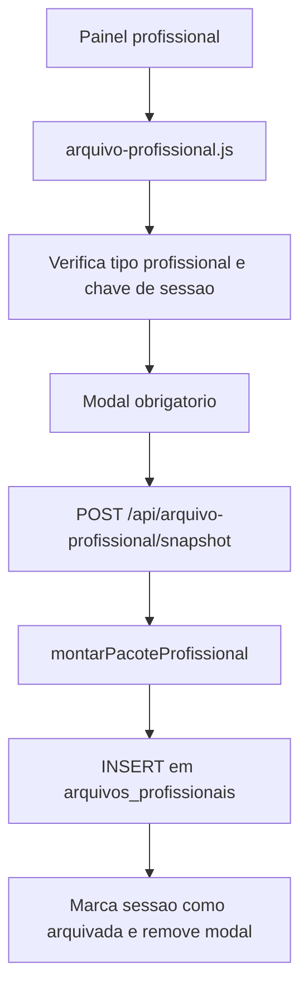

# Arquivo Profissional Central

## Objetivo

O arquivo profissional central registra, no backend do Integrativo.App, um snapshot dos dados assistenciais vinculados ao profissional antes que ele continue a usar ou saia dos painéis profissionais.

A intenção é manter histórico, rastreabilidade e continuidade do cuidado em servidor autorizado da plataforma. O recurso não substitui backup operacional do banco, política de retenção LGPD ou auditoria clínica formal.

## Quando o fluxo é acionado

O script `frontend/js/arquivo-profissional.js` é carregado em painéis profissionais e abre um modal obrigatório quando:

- o usuário salvo em `localStorage.integra_usuario` tem `tipo === "profissional"`;
- a sessão atual ainda não marcou `sessionStorage.integrativo_arquivo_profissional_sessao_ok` como `true`.

Enquanto o arquivamento não termina, o script:

- exibe modal com botão "Arquivar agora no servidor";
- mostra aviso em `beforeunload`;
- intercepta `window.logout()` e impede a saída;
- registra o último arquivamento concluído em `localStorage.integrativo_arquivo_profissional_ultimo`.

Painéis que carregam o script atualmente:

- `frontend/painel-terapeuta.html`
- `frontend/painel-prescricao.html`
- `frontend/painel-recepcao.html`
- `frontend/painel-financeiro.html`
- `frontend/painel-mensagens.html`
- `frontend/painel-rh.html`
- `frontend/painel-revenda.html`
- `frontend/painel-upa.html`
- `frontend/painel-white-label.html`

## Componentes

- `backend/rotas/arquivo-profissional.js`: monta o pacote assistencial, garante tabela e expõe endpoints.
- `backend/server.js`: registra a rota em `/api/arquivo-profissional`.
- `frontend/js/arquivo-profissional.js`: controla modal obrigatório, chamada de snapshot e bloqueio de saída.
- `arquivos_profissionais`: tabela PostgreSQL criada em runtime pela rota, caso ainda não exista.

## Fluxo


```mermaid
flowchart TD
  painel["Painel profissional"] --> script["arquivo-profissional.js"]
  script --> verificaSessao["Verifica tipo profissional e chave de sessao"]
  verificaSessao --> modal["Modal obrigatorio"]
  modal --> postSnapshot["POST /api/arquivo-profissional/snapshot"]
  postSnapshot --> pacote["montarPacoteProfissional"]
  pacote --> banco["INSERT em arquivos_profissionais"]
  banco --> sucesso["Marca sessao como arquivada e remove modal"]
```

## Endpoints

Todos os endpoints exigem JWT e usuário com tipo `profissional` ou `admin`.

### `POST /api/arquivo-profissional/snapshot`

Cria um novo snapshot assistencial para o usuário autenticado.

Resposta de sucesso:

```json
{
  "mensagem": "Dados do profissional arquivados no servidor central.",
  "arquivo": {
    "id": 12,
    "profissional_id": 34,
    "tipo": "snapshot-assistencial",
    "status": "arquivado",
    "totais_json": {
      "pacientes": 2,
      "agendamentos": 5,
      "prescricoes": 1,
      "pagamentos": 3,
      "tiss": 0,
      "fhir": 1
    },
    "criado_em": "2026-06-16T09:00:00.000Z"
  }
}
```

### `GET /api/arquivo-profissional/status`

Consulta o último snapshot do usuário autenticado.

Resposta:

```json
{
  "obrigatorio": true,
  "ultimo_arquivo": {
    "id": 12,
    "tipo": "snapshot-assistencial",
    "status": "arquivado",
    "totais_json": {
      "pacientes": 2,
      "agendamentos": 5,
      "prescricoes": 1,
      "pagamentos": 3,
      "tiss": 0,
      "fhir": 1
    },
    "criado_em": "2026-06-16T09:00:00.000Z"
  }
}
```

## Conteúdo do pacote

`montarPacoteProfissional()` gera um JSON com metadados e dados relacionados ao profissional autenticado:

```json
{
  "sistema": "Integrativo.App",
  "tipo": "arquivo-central-profissional",
  "versao": "1.0",
  "gerado_em": "2026-06-16T09:00:00.000Z",
  "profissional": {},
  "totais": {},
  "dados": {
    "pacientes": [],
    "agendamentos": [],
    "prescricoes": [],
    "pagamentos": [],
    "tiss_guias": [],
    "fhir_exports": []
  }
}
```

Origem dos dados:

- `usuarios`: perfil do profissional e pacientes ligados aos agendamentos.
- `agendamentos`: todos os agendamentos do profissional.
- `prescricoes`: prescrições do profissional.
- `pagamentos`: pagamentos associados aos agendamentos do profissional.
- `tiss_guias`: guias TISS do usuário, quando a tabela existe.
- `fhir_exports`: exportações FHIR do usuário, quando a tabela existe.

Consultas contra tabelas ausentes ou indisponíveis são tratadas como seções vazias e registradas com `console.warn("[arquivo-profissional] Consulta ignorada: ...")`. O snapshot continua quando uma tabela opcional falha.

## Persistência

A tabela `arquivos_profissionais` é criada pela própria rota com `CREATE TABLE IF NOT EXISTS`, não pelo arquivo `migracao-v2.1.sql`.

Estrutura criada:

```sql
CREATE TABLE IF NOT EXISTS arquivos_profissionais (
  id SERIAL PRIMARY KEY,
  profissional_id INTEGER NOT NULL,
  tipo VARCHAR(80) NOT NULL,
  status VARCHAR(40) NOT NULL,
  pacote_json JSONB NOT NULL,
  totais_json JSONB,
  criado_em TIMESTAMP DEFAULT NOW()
);

CREATE INDEX IF NOT EXISTS idx_arquivos_profissionais_profissional
ON arquivos_profissionais (profissional_id, criado_em DESC);
```

Implicações operacionais:

- a primeira chamada de `snapshot` ou `status` precisa de permissão de `CREATE TABLE` e `CREATE INDEX` no banco;
- backups devem incluir `arquivos_profissionais`, pois o JSON completo fica em `pacote_json`;
- ambientes com usuário de banco somente leitura para DDL devem criar a tabela manualmente antes de habilitar o fluxo.

## Teste manual

Com um JWT de profissional ou admin:

```bash
curl -X POST http://localhost:3000/api/arquivo-profissional/snapshot \
  -H "Authorization: Bearer seu_token_jwt"

curl http://localhost:3000/api/arquivo-profissional/status \
  -H "Authorization: Bearer seu_token_jwt"
```

No navegador, também é possível disparar o fluxo exposto pelo script:

```js
window.INTEGRATIVO_ARQUIVO_PROFISSIONAL.arquivarAgora()
window.INTEGRATIVO_ARQUIVO_PROFISSIONAL.deveArquivar()
```

## Troubleshooting

**Modal reaparece a cada nova aba ou sessão**

Isso é esperado quando `sessionStorage.integrativo_arquivo_profissional_sessao_ok` não existe. A chave é por sessão de navegador, não uma dispensa permanente.

**Modal não conclui**

Verifique se `localStorage.integra_token` existe, se `CONFIG.API_URL` aponta para o backend correto e se o usuário autenticado tem tipo `profissional` ou `admin`.

**Erro de banco na primeira chamada**

Confirme se o usuário configurado em `DATABASE_URL` pode executar `CREATE TABLE IF NOT EXISTS` e `CREATE INDEX IF NOT EXISTS`, ou crie a tabela manualmente usando o SQL acima.

**Totais zerados em TISS ou FHIR**

Se `tiss_guias` ou `fhir_exports` não existir no ambiente, o snapshot é salvo com essas seções vazias. Isso preserva o fluxo obrigatório, mas deve ser revisado antes de homologar integrações TISS/FHIR.
