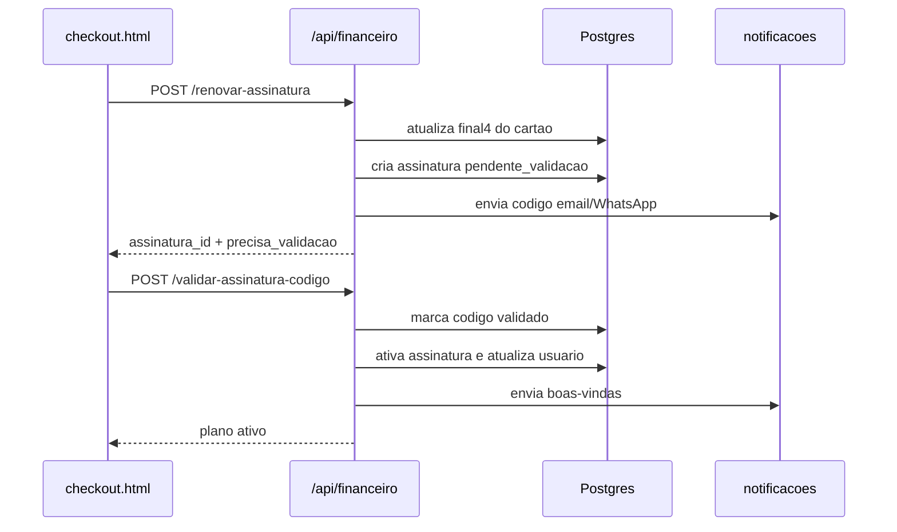

# Assinaturas e Pagamentos

## Objetivo

Este documento descreve o fluxo atual de assinaturas anuais, pagamento de consultas, validacao por codigo e cancelamento no Integrativo.App. A fonte de verdade da regra de negocio fica no backend; o frontend deve apenas coletar dados, exibir simulacoes e chamar a API.

## Componentes

- `backend/rotas/financeiro.js`: planos, parcelamento, criacao/validacao/cancelamento de assinaturas, pagamentos de consulta, nota fiscal e dashboard financeiro.
- `backend/config/stripe.js`: cliente Stripe opcional, modo teste e estorno automatico/simulado.
- `backend/servicos/notificacoes.js`: envio de codigo de validacao, boas-vindas e recibo de cancelamento por email/WhatsApp.
- `frontend/checkout.html`: checkout profissional, cartao obrigatorio, chamada de renovacao e validacao do codigo.
- `frontend/js/config.js`: valores exibidos no frontend, limites comerciais e configuracao de parcelamento/cancelamento.
- `backend/server.js`: monta a rota em `/api/financeiro`.

## Planos e calculo financeiro

Valores anuais definidos no backend:

| Plano | Valor anual | Observacoes |
| --- | ---: | --- |
| `freemium` | R$ 0 | Sem cobranca anual; ainda exige cartao para teleconsultas e servicos usados. |
| `guardioes_floresta` | R$ 200 | Plano social anual; nao recebe desconto PIX no calculo backend. |
| `pro` | R$ 899 | Pode receber desconto ABRATH. |
| `premium` | R$ 4.799 | Pode receber desconto ABRATH e cupom vitalicio especial. |
| `enterprise` | R$ 9.990 | Inclui regra de certificado A1 em cancelamento quando emitido pela plataforma. |

Regras implementadas:

- PIX aplica 5% de desconto, exceto no plano `guardioes_floresta`.
- Cartao em 2 a 12 parcelas usa Tabela Price com juros de 1,99% ao mes.
- Desconto ABRATH e de 8% para `pro` e `premium`, quando `abrath_registro` e `abrath_nome` sao verificados por `verificarRegistroABRATH`.
- O cupom `PRESENTEDOMAU` zera uma assinatura `premium` vitalicia apenas uma vez, gravando `cupom_presentedomau_usado` em `configuracoes`.
- O servidor recalcula todos os valores; nao confie em totais enviados pelo navegador.

## Endpoints

### `POST /api/financeiro/simular-parcelamento`

Publico. Simula o total antes do checkout.

```json
{
  "plano": "pro",
  "forma_pagamento": "cartao",
  "parcelas": 12
}
```

Resposta contem `valorParcela`, `valorTotal`, `juros`, `desconto_pix` e `parcelas`.

### `POST /api/financeiro/renovar-assinatura`

Exige JWT. Cria uma assinatura com status `pendente_validacao` e envia um codigo de 6 digitos por email e WhatsApp quando os canais existem.

Campos principais:

```json
{
  "plano": "premium",
  "forma_pagamento": "pix",
  "parcelas": 1,
  "cartao_obrigatorio_confirmado": true,
  "cartao_final4": "4242",
  "gateway_id": "pi_123",
  "abrath_registro": "12345",
  "abrath_nome": "Nome Profissional"
}
```

Restricoes:

- `plano` deve existir em `VALORES_ANUAIS`.
- `cartao_obrigatorio_confirmado` e `cartao_final4` sao obrigatorios, inclusive para Freemium e PIX.
- A assinatura nao fica ativa imediatamente; o usuario precisa validar o codigo.

### `POST /api/financeiro/validar-assinatura-codigo`

Exige JWT. Ativa a assinatura pendente.

```json
{
  "assinatura_id": 123,
  "codigo": "123456"
}
```

Regras:

- O codigo expira em 15 minutos.
- Sao permitidas ate 5 tentativas por validacao.
- A assinatura deve estar com status `pendente_validacao`.
- Ao validar, a assinatura muda para `ativa` e `usuarios` recebe `plano`, `assinatura_ativa` e `data_expiracao_assinatura`.
- Para `freemium`, `assinatura_ativa` fica `0`; para planos pagos/vitalicios, fica `1`.

### `POST /api/financeiro/cancelar-assinatura`

Exige JWT. Cancela somente assinaturas `ativa` do proprio usuario.

```json
{
  "assinatura_id": 123
}
```

Calculo atual:

- Ate 15 dias desde `data_inicio`: calcula reembolso integral do valor pago no ciclo.
- Apos 15 dias em assinatura anual: calcula meses restantes, retendo 20% sobre o saldo proporcional restante.
- Em `premium` e `enterprise`, se `certificado_a1_emitido_plataforma = true`, subtrai R$ 260,00 do estorno.
- Se `gateway_id` existir, tenta estorno automatico via Stripe.
- Em `TEST_MODE=true` ou `gateway_id` iniciado por `test_`, o estorno e simulado.
- Sem `gateway_id`, o backend retorna `estorno_gateway.status = "nao_enviado"` e o financeiro precisa tratar manualmente.

O backend grava recibo em `cancelamento_recibo`, atualiza a assinatura para `cancelada`, redefine o usuario para `freemium` e envia email de cancelamento.

### Outros endpoints financeiros

- `POST /api/financeiro/pagar`: registra pagamento pendente de consulta usando o valor do `agendamentos`, nunca o valor enviado no body.
- `GET /api/financeiro/meus-pagamentos`: lista ate 50 pagamentos do usuario autenticado.
- `POST /api/financeiro/nota-fiscal`: emite NF para pagamento do proprio usuario; produto emite direto, consulta exige `autorizar`.
- `GET /api/financeiro/dashboard`: retorna soma de pagamentos aprovados e quantidade de assinaturas ativas. Atualmente exige autenticacao, mas nao aplica filtro de perfil.

## Fluxo do checkout profissional



## Variaveis de ambiente relevantes

Obrigatorias para o backend:

- `DATABASE_URL`
- `JWT_SECRET`

Pagamentos e estornos:

- `TEST_MODE=true`: habilita caminhos simulados em pagamentos/estornos.
- `STRIPE_SECRET_KEY`: necessario para estorno automatico real via Stripe.

Notificacoes:

- `EMAIL_WEBHOOK_URL`: se ausente, emails sao apenas logados como simulacao.
- `EMAIL_WEBHOOK_TOKEN`: token Bearer opcional para o webhook de email.
- `EMAIL_TIMEOUT_MS`: timeout do webhook; padrao de codigo: 15000 ms.
- `FRONTEND_URL`: base usada no link do manual em boas-vindas.
- `EVOLUTION_API_URL`, `EVOLUTION_API_KEY`, `EVOLUTION_INSTANCE`, `EVOLUTION_SIMULATE`: envio de WhatsApp via Evolution API.

## Banco de dados e armadilhas comuns

Antes de habilitar checkout em uma base nova, valide a tabela `assinaturas`. O arquivo `migracao-v2.1.sql` ainda contem uma versao antiga do schema (`valor_anual`, `valor_pago`, `data_fim`), mas a rota atual insere e le colunas como:

- `tipo_ciclo`
- `valor`
- `data_expiracao`
- `renovacao_automatica`
- `data_cancelamento`
- `forma_pagamento`
- `gateway_id`
- `gateway_resposta`
- `valor_estornado`
- `estorno_gateway_id`
- `estorno_status`
- `estorno_resposta`
- `certificado_a1_emitido_plataforma`
- `cancelamento_recibo`

A rota cria algumas colunas com `ALTER TABLE ... ADD COLUMN IF NOT EXISTS` e cria `assinatura_validacoes` sob demanda, mas ela nao cria a tabela base `assinaturas` nem todas as colunas historicas usadas no cancelamento. Se a base vier somente de `migracao-v2.1.sql`, o checkout pode falhar no primeiro `INSERT`.

Checklist rapido para nova base:

1. Confirmar que `usuarios` possui `plano`, `assinatura_ativa`, `data_expiracao_assinatura`, `cartao_final4`, `cartao_obrigatorio_confirmado` e `cartao_atualizado_em`.
2. Confirmar que `assinaturas` possui as colunas atuais listadas acima.
3. Fazer uma assinatura Freemium em `TEST_MODE=true` e validar o codigo pelo log/email simulado.
4. Fazer uma assinatura paga com `gateway_id` iniciado por `test_` para validar cancelamento e estorno simulado.
5. Verificar se o frontend alfa aponta para o backend esperado em `frontend/js/config.js`.

## Exemplos de validacao local

Simular parcelamento:

```bash
curl -X POST http://localhost:3000/api/financeiro/simular-parcelamento \
  -H "Content-Type: application/json" \
  -d '{"plano":"pro","forma_pagamento":"cartao","parcelas":12}'
```

Criar assinatura pendente:

```bash
curl -X POST http://localhost:3000/api/financeiro/renovar-assinatura \
  -H "Content-Type: application/json" \
  -H "Authorization: Bearer SEU_TOKEN" \
  -d '{
    "plano": "freemium",
    "forma_pagamento": "cartao_cadastro",
    "parcelas": 1,
    "cartao_obrigatorio_confirmado": true,
    "cartao_final4": "4242"
  }'
```

Validar codigo:

```bash
curl -X POST http://localhost:3000/api/financeiro/validar-assinatura-codigo \
  -H "Content-Type: application/json" \
  -H "Authorization: Bearer SEU_TOKEN" \
  -d '{"assinatura_id":123,"codigo":"123456"}'
```

## Troubleshooting

**Erro: "Cartao de credito obrigatorio..."**  
O checkout deve enviar `cartao_obrigatorio_confirmado: true` e `cartao_final4`. Isso e exigido ate para plano gratuito.

**Assinatura criada, mas usuario continua Freemium**  
Verifique se `/validar-assinatura-codigo` foi chamado com o codigo correto antes da expiracao de 15 minutos.

**Codigo nunca chega**  
Sem `EMAIL_WEBHOOK_URL`, o email fica em log como `[EMAIL SIMULADO]`. Para WhatsApp, confira Evolution API ou use `EVOLUTION_SIMULATE=true` em alfa/teste.

**Cancelamento calculou estorno, mas nao enviou ao gateway**  
Confira se `assinaturas.gateway_id` foi preenchido. Sem ele o backend retorna `nao_enviado` e o financeiro deve processar manualmente.

**Erro de coluna na tabela `assinaturas`**  
Compare a base com a lista de colunas deste runbook. A migracao SQL principal esta defasada para este fluxo e precisa ser complementada antes do teste de checkout.
