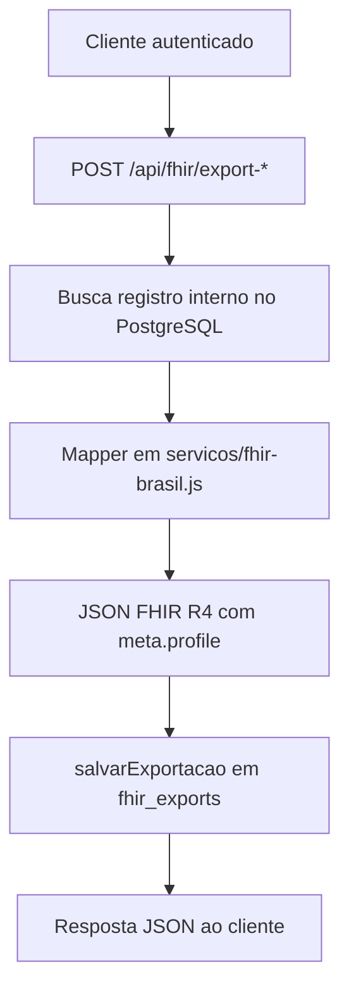

# FHIR Brasil R4

## Objetivo

O modulo FHIR Brasil R4 converte registros internos do Integrativo.App em recursos FHIR alinhados aos perfis HL7 Brasil/RNDS configurados no backend. Ele tambem consulta fontes cientificas externas usadas pelas bibliotecas integrativas e mantem cache de protocolos Fiocruz para reduzir falhas e latencia.

Este modulo nao envia dados para a RNDS hoje. `RNDS_ENABLED` e `RNDS_AUTH_URL` existem em `backend/config/fhir.js`, mas nao ha rota de submissao RNDS implementada em `backend/rotas/fhir.js`.

## Componentes

- `backend/rotas/fhir.js`: endpoints HTTP, consultas ao banco, chamadas externas e cache.
- `backend/servicos/fhir-brasil.js`: mapeadores entre modelo interno e recursos FHIR.
- `backend/config/fhir.js`: URLs, perfis, naming systems, code systems e flags RNDS.
- `backend/server.js`: monta `/api/fhir` e agenda `atualizarProtocolosFiocruz` todo dia as 02:00.
- `migracao-v2.1.sql`: cria `fhir_exports`, `cache_protocolos` e `referencias_protocolos`.
- `frontend/js/config.js`: lista endpoints FHIR consumidos pelo frontend.

## Recursos suportados

| Recurso FHIR | Origem interna | Mapper |
| --- | --- | --- |
| `Patient` | `usuarios` com `tipo = 'paciente'` | `pacienteParaPatient` |
| `Practitioner` | `usuarios` com `tipo IN ('profissional', 'admin')` | `profissionalParaPractitioner` |
| `Organization` | dados do usuario/profissional | `usuarioParaOrganization` |
| `Appointment` | `agendamentos` + paciente/profissional | `agendamentoParaAppointment` |
| `Encounter` | `agendamentos` + paciente/profissional | `agendamentoParaEncounter` |
| `MedicationRequest` | `prescricoes` + itens da prescricao | `prescricaoParaMedicationRequest` |
| `Bundle` | composicao de paciente, profissional, organizacao, atendimento e agendamento | `criarBundle` |
| `Observation` | helper de texto, sem rota direta dedicada | `observacaoDeTexto` |
| `Condition` | helper de texto, sem rota direta dedicada | `condicaoDeTexto` |

## Fluxo de exportacao



As exportacoes sao persistidas em `fhir_exports` com:

- `usuario_id`: usuario autenticado que solicitou a exportacao.
- `tipo_recurso`: exemplo `Patient`, `Practitioner`, `Bundle`.
- `recurso_id`: ID interno do registro exportado.
- `fhir_json`: JSON FHIR gerado.
- `url_fhir`: URL calculada com `FHIR_BASE_URL`.

`GET /api/fhir/exports/:tipo/:id` retorna a exportacao mais recente daquele recurso.

## Endpoints

| Metodo | Rota | Auth | Uso |
| --- | --- | --- | --- |
| `GET` | `/api/fhir/metadata` | Nao | `CapabilityStatement` local com recursos e perfis suportados |
| `POST` | `/api/fhir/export-patient` | Sim | Exporta `Patient`; corpo: `pacienteId` ou `patientId` |
| `POST` | `/api/fhir/export-practitioner` | Sim | Exporta `Practitioner`; corpo: `profissionalId` ou `practitionerId` |
| `POST` | `/api/fhir/export-organization` | Sim | Exporta `Organization`; corpo opcional: `usuarioId` |
| `POST` | `/api/fhir/export-appointment` | Sim | Exporta `Appointment`; corpo: `agendamentoId` ou `appointmentId` |
| `POST` | `/api/fhir/export-encounter` | Sim | Exporta `Encounter`; corpo: `agendamentoId` ou `encounterId` |
| `POST` | `/api/fhir/export-medication-request` | Sim | Exporta `MedicationRequest`; corpo: `prescricaoId` ou `medicationRequestId` |
| `POST` | `/api/fhir/export-bundle` | Sim | Exporta `Bundle` de atendimento; corpo: `agendamentoId` |
| `POST` | `/api/fhir/import-patient` | Sim | Valida e mapeia `resourceType: "Patient"` para dados internos, sem persistir paciente |
| `GET` | `/api/fhir/exports/:tipo/:id` | Sim | Recupera a ultima exportacao persistida |
| `GET` | `/api/fhir/protocolos-fiocruz` | Sim | Consulta Fiocruz e atualiza cache por especialidade |
| `GET` | `/api/fhir/pesquisas-redepics` | Sim | Consulta pesquisas RedePICS |
| `GET` | `/api/fhir/artigos-bireme` | Sim | Consulta artigos BIREME |
| `POST` | `/api/fhir/comparar-protocolos` | Sim | Compara Fiocruz, RedePICS e BIREME por especialidade |

## Exemplos

### Metadata sem autenticacao

```bash
curl http://localhost:3000/api/fhir/metadata
```

### Exportar paciente

```bash
curl -X POST http://localhost:3000/api/fhir/export-patient \
  -H "Content-Type: application/json" \
  -H "Authorization: Bearer <jwt>" \
  -d '{"pacienteId": 123}'
```

### Recuperar ultima exportacao

```bash
curl http://localhost:3000/api/fhir/exports/Patient/123 \
  -H "Authorization: Bearer <jwt>"
```

### Importar Patient para modelo interno

```bash
curl -X POST http://localhost:3000/api/fhir/import-patient \
  -H "Content-Type: application/json" \
  -H "Authorization: Bearer <jwt>" \
  -d '{
    "resource": {
      "resourceType": "Patient",
      "name": [{ "text": "Maria Silva" }],
      "gender": "female"
    }
  }'
```

## Configuracao

Variaveis relevantes:

| Variavel | Padrao | Uso |
| --- | --- | --- |
| `FHIR_BASE_URL` | `http://localhost:3000/api/fhir` | Base usada em `url_fhir` e `Bundle.entry.fullUrl` |
| `FHIR_HAPI_URL` | `https://hapi.fhir.org.br/fhir` | URL configurada para HAPI; nao ha proxy generico exposto hoje |
| `FIOCRUZ_API_URL` | `https://arca.fiocruz.br/api` | Base para `/protocolos-fiocruz` e cron de cache |
| `FIOCRUZ_API_KEY` | vazio | Bearer opcional nas consultas Fiocruz |
| `REDEPICS_API_URL` | `https://redepicsbrasil.org.br/api` | Base para `/pesquisas-redepics` |
| `REDEPICS_API_KEY` | vazio | Bearer opcional nas consultas RedePICS |
| `BIREME_API_URL` | `https://www.bireme.org.br/api` | Base para `/artigos-bireme` |
| `BIREME_API_KEY` | vazio | Bearer opcional nas consultas BIREME |
| `RNDS_ENABLED` | `false` | Flag de configuracao sem rota de envio implementada |
| `RNDS_AUTH_URL` | `https://ehr-services.saude.gov.br/api/auth/token` | Preparado para integracao futura |

Em alfa, `FHIR_BASE_URL` deve apontar para:

```text
https://integrativoappespelho.onrender.com/api/fhir
```

## Cache e jobs

`GET /api/fhir/protocolos-fiocruz` tenta consultar a API externa e, quando recebe dados, grava `cache_protocolos` por `especialidade`. Se a consulta externa falhar, retorna o cache da especialidade quando existir.

O cron das 02:00 chama `atualizarProtocolosFiocruz` para estas especialidades:

```text
fitoterapia, ayurveda, mtc, yoga, massoterapia, aromaterapia, fisioterapia, reiki, acupuntura
```

Falhas em uma especialidade sao logadas e nao interrompem as demais.

## Restricoes conhecidas

- Exportacoes geram JSON FHIR local; nao ha validacao contra servidor HAPI nem submissao RNDS no fluxo atual.
- `import-patient` apenas mapeia e retorna dados internos; nao cria usuario/paciente.
- `referencias_protocolos` existe na migracao, mas `comparar-protocolos` hoje retorna a comparacao diretamente e nao persiste nessa tabela.
- As consultas Fiocruz/RedePICS/BIREME dependem do formato real das APIs externas configuradas por ambiente.
- `MedicationRequest` usa o primeiro item da prescricao como `medicationCodeableConcept` principal e os demais entram em `dosageInstruction`.

## Manutencao

Ao adicionar novo recurso FHIR:

1. Criar mapper em `backend/servicos/fhir-brasil.js`.
2. Adicionar perfil em `backend/config/fhir.js`, se aplicavel.
3. Criar rota autenticada em `backend/rotas/fhir.js`.
4. Persistir exportacao com `salvarExportacao` quando o recurso representar dado interno.
5. Atualizar `frontend/js/config.js`, `README_v2.1.md` e este documento.
6. Adicionar smoke test com `curl` em `SETUP_LOCAL_SUPABASE.md` se a rota for publica para desenvolvedores.
