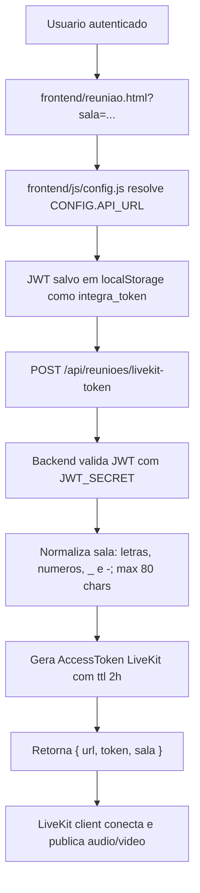

# Teleconsulta LiveKit

## Objetivo

A teleconsulta do Integrativo.App usa LiveKit para criar salas WebRTC sem expor as chaves do provedor no navegador. O backend emite tokens temporarios para usuarios autenticados e o frontend usa esse token para entrar na sala indicada pela URL.

Este documento cobre o fluxo implementado hoje: autenticacao, emissao de token, entrada na sala, publicacao de audio/video e checklist de alfa. Recursos como gravacao, transcricao, convite por WhatsApp e atualizacao automatica de status de agendamento devem ser tratados como evolucoes separadas enquanto nao houver rota backend correspondente.

## Decisao Arquitetural

As credenciais LiveKit ficam somente no backend:

- `LIVEKIT_URL`
- `LIVEKIT_API_KEY`
- `LIVEKIT_API_SECRET`

O navegador envia o JWT da aplicacao para `/api/reunioes/livekit-token`. A resposta contem a URL LiveKit, um token assinado e o nome normalizado da sala. O token LiveKit tem TTL de 2 horas e grants restritos a uma sala.

## Fluxo



## Componentes

- `backend/rotas/reunioes.js`: rota autenticada de emissao de token LiveKit.
- `frontend/reuniao.html`: cliente LiveKit via CDN, leitura de `?sala=`, criacao de tracks locais, mute/camera/tela.
- `frontend/painel-terapeuta.html`: abre `reuniao.html?sala=<id>&embed=1` dentro do painel profissional.
- `frontend/js/config.js`: envia dominios `alfa`/`alpha` para `https://integrativoappespelho.onrender.com/api`; localhost usa `http://localhost:3001/api`.
- `.env.example` e Render: variaveis LiveKit e `CORS_ORIGINS`.

## Endpoint

### `POST /api/reunioes/livekit-token`

Autenticacao: `Authorization: Bearer <jwt-da-aplicacao>`.

Corpo aceito:

```json
{
  "sala": "teleconsulta-alfa",
  "nome": "Dra. Ana"
}
```

Campos alternativos:

- `agendamento_id` pode substituir `sala`.
- Sem `sala` nem `agendamento_id`, o backend usa `teleconsulta-alfa`.
- Sem `nome`, o backend tenta `req.usuario.nome`, depois `req.usuario.email`, depois `Participante`.

Resposta:

```json
{
  "url": "wss://seu-projeto.livekit.cloud",
  "token": "<jwt-livekit>",
  "sala": "teleconsulta-alfa"
}
```

Grants do token LiveKit:

- `room`: sala normalizada.
- `roomJoin: true`
- `canPublish: true`
- `canSubscribe: true`
- `canPublishData: true`
- `ttl: 2h`

## Normalizacao da sala

`normalizarSala` remove acentos, troca caracteres fora de `[a-zA-Z0-9_-]` por `-`, compacta multiplos hifens e limita o resultado a 80 caracteres. Isso evita nomes de sala com espacos, barras ou caracteres especiais vindos de links publicos.

## Falhas esperadas

| Sintoma | Causa provavel | Verificacao |
| --- | --- | --- |
| `401 Não autorizado` | Header `Authorization` ausente | Confirmar `localStorage.integra_token` e login antes de abrir `reuniao.html` |
| `401 Token inválido` | JWT da aplicacao expirado ou assinado com outro `JWT_SECRET` | Reautenticar no mesmo backend usado pelo frontend |
| `500 LiveKit não configurado no ambiente.` | `LIVEKIT_URL`, `LIVEKIT_API_KEY` ou `LIVEKIT_API_SECRET` ausente | Conferir variaveis no Render ou `.env` local |
| `Erro ao conectar LiveKit` no navegador | Token emitido, mas LiveKit recusou conexao ou WebRTC falhou | Conferir URL `wss://`, chaves LiveKit e permissao de camera/microfone |
| CORS no frontend alfa | `CORS_ORIGINS` nao inclui `https://integrativoapp-alfa.vercel.app` | Conferir variavel do backend alfa |

## Alfa e ambiente local

Ambiente alfa recomendado:

```text
Frontend: https://integrativoapp-alfa.vercel.app
Backend:  https://integrativoappespelho.onrender.com/api
Sala:     /reuniao.html?sala=teleconsulta-alfa
```

Variaveis minimas do backend alfa:

```env
NODE_ENV=test
TEST_MODE=true
CORS_ORIGINS=https://integrativoapp-alfa.vercel.app
JWT_SECRET=<chave exclusiva do alfa>
LIVEKIT_URL=wss://...
LIVEKIT_API_KEY=...
LIVEKIT_API_SECRET=...
```

Para teste local usando o script `dev:teste`, o frontend em `localhost` resolve a API para `http://localhost:3001/api`; portanto o backend local de teste deve subir em `PORT=3001`.

## Checklist de validacao

1. Fazer login como profissional no mesmo frontend que chamara a sala.
2. Abrir `/reuniao.html?sala=teleconsulta-alfa`.
3. Confirmar que a chamada `POST /api/reunioes/livekit-token` retorna `200`.
4. Permitir camera e microfone.
5. Abrir a mesma sala em outro navegador/dispositivo com outro usuario autenticado.
6. Confirmar audio/video nos dois lados, mute, camera off, compartilhamento de tela e saida da sala.
7. Validar que erros de ambiente aparecem como `LiveKit não configurado no ambiente.` em vez de expor chaves.

## Fora do escopo implementado

As telas mencionam chat e gravacoes, mas `backend/rotas/reunioes.js` implementa somente emissao de token LiveKit. Antes de prometer esses recursos como operacionais, criar e documentar rotas para:

- convite e entrega de link por WhatsApp/e-mail;
- vinculo obrigatorio da sala a um `agendamento`;
- persistencia de status `em_andamento`/`realizado`;
- gravacao, retencao e download;
- transcricao/STT e anexos de prontuario.
