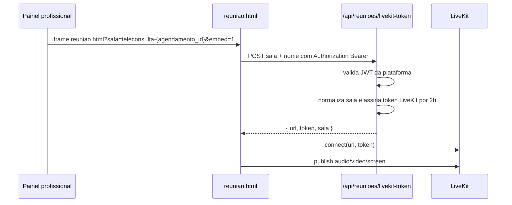

# Teleconsulta LiveKit

## Objetivo

O fluxo de teleconsulta do Integrativo.App permite que profissionais e pacientes entrem em uma sala WebRTC gerenciada pelo LiveKit. O backend emite tokens temporarios de acesso e o frontend publica audio, video e compartilhamento de tela no navegador.

Este documento descreve o comportamento implementado hoje. Recursos de gravacao, transcricao, persistencia de chat e armazenamento de arquivos ainda nao existem no backend.

## Decisao Arquitetural

As credenciais do LiveKit ficam somente no backend. O navegador nunca recebe `LIVEKIT_API_KEY` nem `LIVEKIT_API_SECRET`; ele recebe apenas:

- URL publica do LiveKit (`url`);
- token JWT assinado pelo SDK do LiveKit (`token`);
- nome normalizado da sala (`sala`).

```txt
Frontend autenticado -> /api/reunioes/livekit-token -> LiveKit token -> LiveKit room
```

## Fluxo



Tambem e possivel abrir a pagina diretamente em `/reuniao.html?sala=teleconsulta-alfa`, desde que exista `integra_token` valido no `localStorage`.

## Componentes

- `backend/rotas/reunioes.js`: gera tokens LiveKit em `POST /api/reunioes/livekit-token`.
- `backend/server.js`: registra a rota em `/api/reunioes`.
- `frontend/reuniao.html`: conecta ao SDK `livekit-client`, publica audio/video e controla tela.
- `frontend/painel-terapeuta.html`: cria salas `teleconsulta-{id}` e embute `reuniao.html` em iframe.
- `frontend/js/config.js`: resolve a API por hostname (`localhost` -> `http://localhost:3001/api`, dominios `alfa`/`alpha` -> backend espelho).
- `.env.example` e `render.yaml`: listam variaveis LiveKit.

## Contrato da API

### `POST /api/reunioes/livekit-token`

Requer `Authorization: Bearer <jwt-da-plataforma>`.

Payload aceito:

```json
{
  "sala": "teleconsulta-123",
  "nome": "Profissional Demo"
}
```

Alternativamente, `agendamento_id` pode ser enviado no lugar de `sala`.

Resposta:

```json
{
  "url": "wss://seu-projeto.livekit.cloud",
  "token": "<jwt-livekit>",
  "sala": "teleconsulta-123"
}
```

Regras verificadas no codigo:

- se `LIVEKIT_URL`, `LIVEKIT_API_KEY` ou `LIVEKIT_API_SECRET` estiverem ausentes, a API retorna `500`;
- o token LiveKit tem TTL de 2 horas;
- a identidade do participante vem de `req.usuario.id`, `req.usuario.email` ou timestamp;
- a sala remove acentos, troca caracteres fora de `[a-zA-Z0-9_-]` por `-`, compacta hifens e limita a 80 caracteres.

## Variaveis de Ambiente

Obrigatorias para teleconsulta real:

```env
LIVEKIT_URL=wss://seu-projeto.livekit.cloud
LIVEKIT_API_KEY=sua_api_key_livekit
LIVEKIT_API_SECRET=seu_api_secret_livekit
JWT_SECRET=chave_forte_da_plataforma
CORS_ORIGINS=http://localhost:8000,https://integrativoapp-alfa.vercel.app
```

Para desenvolvimento local com o `frontend/js/config.js` atual, rode o backend em `PORT=3001` ou exponha `window.INTEGRATIVO_API_URL` antes de carregar `config.js`.

## Validacao Local

1. Inicie o backend com `.env` contendo LiveKit e `JWT_SECRET`.
2. Sirva o frontend em `http://localhost:8000`.
3. Faca login para gravar `integra_token` e `integra_usuario` no navegador.
4. Abra `/reuniao.html?sala=teleconsulta-alfa`.
5. Abra a mesma sala em outro navegador/dispositivo com outro usuario autenticado.
6. Confirme:
   - prompt de camera/microfone;
   - status `Conectado a sala: teleconsulta-alfa`;
   - audio/video nos dois lados;
   - mutar microfone;
   - desligar camera;
   - compartilhar tela;
   - sair da sala.

## Validacao Alfa

O frontend alfa deve chamar:

```txt
https://integrativoappespelho.onrender.com/api
```

Confirme no Render do servico `integrativoappespelho`:

- `LIVEKIT_URL`;
- `LIVEKIT_API_KEY`;
- `LIVEKIT_API_SECRET`;
- `JWT_SECRET`;
- `CORS_ORIGINS=https://integrativoapp-alfa.vercel.app`.

Depois valide pelo painel profissional:

1. entre como profissional;
2. abra o painel terapeuta;
3. inicie a teleconsulta de um agendamento online;
4. confirme que o iframe aponta para `reuniao.html?sala=teleconsulta-{id}&embed=1`;
5. entre na mesma sala em outro navegador/dispositivo.

## O Que Ainda Nao Esta Implementado

As telas citam recursos que hoje sao apenas comportamento local de interface:

- gravacao real no servidor;
- autorizacao distribuida de todos os participantes para gravar;
- lista real de gravacoes;
- download de gravacoes;
- expiracao automatica de gravacoes;
- lembrete 24h antes da exclusao;
- transcricao/STT;
- persistencia de chat;
- acesso a prontuario dentro da sala;
- mudanca automatica de status do agendamento.

Enquanto esses recursos nao tiverem rotas, armazenamento e jobs proprios, documente-os como futuros e nao como garantia operacional.

## Manutencao

- Mantenha qualquer nova permissao LiveKit centralizada em `backend/rotas/reunioes.js`.
- Nunca coloque segredo LiveKit no frontend.
- Ao alterar a regra de nomes de sala, valide `painel-terapeuta.html` e links diretos para `reuniao.html`.
- Antes de liberar em alfa/producao, teste dois navegadores/dispositivos para detectar bloqueios de permissao, CORS e firewall.
