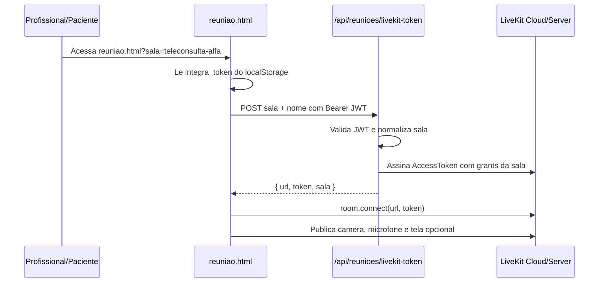

# Teleconsulta LiveKit

## Objetivo

A teleconsulta usa LiveKit para audio, video e compartilhamento de tela em salas WebRTC autenticadas. O backend do Integrativo.App nao expoe as chaves do LiveKit ao navegador; ele valida o JWT da aplicacao e gera um token temporario para a sala solicitada.

## Componentes

- `backend/rotas/reunioes.js`: rota `POST /api/reunioes/livekit-token`, autenticacao JWT, normalizacao do nome da sala e geracao do token LiveKit.
- `backend/server.js`: registra as rotas em `/api/reunioes`.
- `frontend/reuniao.html`: tela de sala, obtencao do token, conexao com `livekit-client`, publicacao de audio/video local e compartilhamento de tela.
- `frontend/painel-terapeuta.html`: abre a sala em modo embed usando `reuniao.html?sala=<id>&embed=1`.

## Fluxo


```mermaid
sequenceDiagram
  participant Usuario as Profissional/Paciente
  participant Frontend as reuniao.html
  participant Backend as /api/reunioes/livekit-token
  participant LiveKit as LiveKit Cloud/Server

  Usuario->>Frontend: Acessa reuniao.html?sala=teleconsulta-alfa
  Frontend->>Frontend: Le integra_token do localStorage
  Frontend->>Backend: POST sala + nome com Bearer JWT
  Backend->>Backend: Valida JWT e normaliza sala
  Backend->>LiveKit: Assina AccessToken com grants da sala
  Backend-->>Frontend: { url, token, sala }
  Frontend->>LiveKit: room.connect(url, token)
  Frontend->>LiveKit: Publica camera, microfone e tela opcional
```

## Endpoint

### `POST /api/reunioes/livekit-token`

Requer `Authorization: Bearer <jwt-da-aplicacao>`.

Payload aceito:

```json
{
  "sala": "teleconsulta-alfa",
  "nome": "Participante"
}
```

Se `sala` nao vier, o backend usa `agendamento_id`; se ambos faltarem, usa `teleconsulta-alfa`. A sala e normalizada para caracteres `a-z`, `A-Z`, `0-9`, `_` e `-`, com tamanho maximo de 80 caracteres.

Resposta:

```json
{
  "url": "wss://...",
  "token": "<jwt-livekit>",
  "sala": "teleconsulta-alfa"
}
```

O token LiveKit tem TTL de 2 horas e concede:

- `roomJoin`;
- `canPublish`;
- `canSubscribe`;
- `canPublishData`.

## Variaveis de ambiente

Obrigatorias no backend que vai gerar tokens reais:

```text
LIVEKIT_URL=wss://...
LIVEKIT_API_KEY=...
LIVEKIT_API_SECRET=...
JWT_SECRET=...
CORS_ORIGINS=https://integrativoapp-alfa.vercel.app
```

Sem as variaveis `LIVEKIT_URL`, `LIVEKIT_API_KEY` e `LIVEKIT_API_SECRET`, a rota retorna `500` com `LiveKit nao configurado no ambiente.`

## Comportamento implementado hoje

- Login obrigatorio antes de entrar na sala; sem `integra_token`, a tela redireciona para `login.html`.
- Conexao LiveKit com `adaptiveStream` e `dynacast`.
- Publicacao de audio e video locais via `createLocalTracks`.
- Assinatura de tracks remotos de video via evento `TrackSubscribed`.
- Lista simples de participantes remotos.
- Mutar/desmutar microfone local.
- Ligar/desligar camera local.
- Compartilhar/parar compartilhamento de tela.
- Encerrar sala com `room.disconnect()`.

## Limites atuais

Os itens abaixo aparecem na interface, mas ainda nao tem integracao real no backend ou no LiveKit:

- gravacao persistente da teleconsulta;
- armazenamento, expurgo automatico e download de gravacoes;
- autorizacao formal de todos os participantes para gravacao;
- chat em tempo real entre participantes;
- persistencia de mensagens de chat;
- atualizacao automatica de status do agendamento para "em andamento" ou "realizado";
- envio automatico de link por WhatsApp ou email.

Na implementacao atual, o botao de gravacao apenas alterna estado visual e alertas no navegador. O chat adiciona mensagens somente no DOM local da pagina.

## Troubleshooting

### `401 Nao autorizado`

- Verifique se o usuario esta logado e se `localStorage.integra_token` existe.
- Confirme que o `JWT_SECRET` do backend e o mesmo usado para emitir o token da aplicacao.

### `500 LiveKit nao configurado no ambiente`

- Preencha `LIVEKIT_URL`, `LIVEKIT_API_KEY` e `LIVEKIT_API_SECRET` no Render ou no `.env` local.
- Garanta que o deploy foi reiniciado depois da troca de variaveis.

### Frontend chama backend errado

- Em localhost, `frontend/js/config.js` aponta para `http://localhost:3001/api`.
- Em dominios com `alfa` ou `alpha`, aponta para `https://integrativoappespelho.onrender.com/api`.
- Em producao, aponta para `https://integra-backend-ynrd.onrender.com/api`.
- Se o navegador bloquear a chamada, inclua a origem do frontend em `CORS_ORIGINS`.

### Camera ou microfone nao aparecem

- Confirme permissao do navegador para camera/microfone.
- Use HTTPS no ambiente remoto; navegadores bloqueiam captura de midia em origens inseguras.
- Verifique se outro aplicativo nao esta usando o dispositivo.

### Participante entra em sala diferente

- Compare o valor final `sala` retornado pelo endpoint. A normalizacao troca caracteres invalidos por `-` e corta o nome em 80 caracteres.
- Ao abrir a partir do painel, confira o parametro `sala` em `reuniao.html?sala=<id>`.

## Checklist minimo de validacao

1. Fazer login como profissional.
2. Abrir `/reuniao.html?sala=teleconsulta-alfa`.
3. Confirmar resposta `200` de `POST /api/reunioes/livekit-token`.
4. Abrir a mesma sala em outro navegador/dispositivo autenticado.
5. Confirmar audio e video nos dois lados.
6. Testar mute, camera off, compartilhamento de tela e sair da sala.
7. Confirmar que gravacao e chat nao foram tratados como recursos persistentes no teste.
