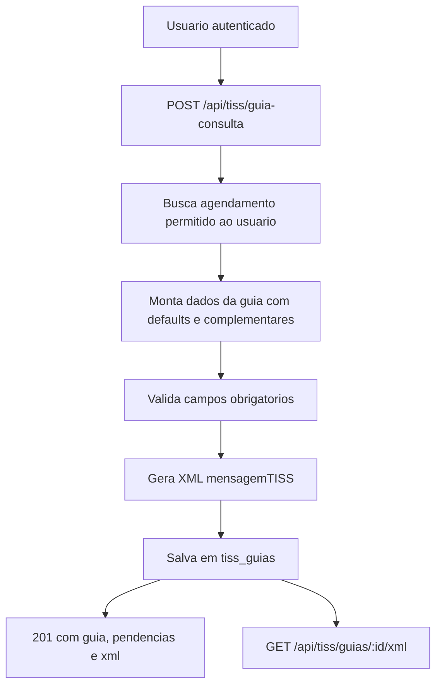

# TISS Guia de Consulta

## Objetivo

A integracao TISS gera uma Guia de Consulta no padrao ANS configurado para o ambiente, a partir de um agendamento existente. Ela transforma dados do agendamento, paciente, profissional e campos complementares da operadora em JSON persistido e XML TISS para download.

O fluxo atual cobre geracao e arquivamento interno da guia. Ele nao envia lotes para operadoras, nao assina XML com certificado digital e nao consulta WSDL de autorizacao.

## Componentes

- `backend/config/tiss.js`: versao TISS, namespace, URL base e defaults por ambiente.
- `backend/servicos/tiss.js`: normalizacao dos dados, validacao de campos obrigatorios, geracao do XML, criacao da tabela `tiss_guias` e persistencia.
- `backend/rotas/tiss.js`: endpoints HTTP em `/api/tiss`, autenticacao e busca do agendamento.
- `backend/server.js`: registra `app.use('/api/tiss', tissRoutes)`.
- `backend/rotas/arquivo-profissional.js`: inclui registros de `tiss_guias` no snapshot do arquivo central profissional.

## Fluxo



## Autorizacao e escopo dos dados

- `GET /api/tiss/metadata` e publico e retorna as capacidades da integracao.
- As rotas de geracao, consulta e download exigem JWT via middleware `autenticar`.
- A guia so pode ser gerada quando o usuario autenticado e paciente do agendamento, profissional do agendamento ou `admin`.
- A consulta posterior usa `usuario_id = req.usuario.id`; portanto a guia fica vinculada ao usuario que a gerou.

## Endpoints

### `GET /api/tiss/metadata`

Retorna metadados operacionais e campos complementares aceitos.

```bash
curl http://localhost:3000/api/tiss/metadata
```

Resposta esperada:

```json
{
  "sistema": "Integrativo.App TISS",
  "versaoTiss": "4.01.00",
  "namespace": "http://www.ans.gov.br/padroes/tiss/schemas",
  "formatos": ["xml", "json"],
  "tiposGuia": ["guiaConsulta"],
  "endpoints": [
    "GET /api/tiss/metadata",
    "POST /api/tiss/guia-consulta",
    "GET /api/tiss/guias/:id",
    "GET /api/tiss/guias/:id/xml"
  ]
}
```

### `POST /api/tiss/guia-consulta`

Gera uma Guia de Consulta a partir de `agendamentoId`.

```bash
curl -X POST http://localhost:3000/api/tiss/guia-consulta \
  -H "Content-Type: application/json" \
  -H "Authorization: Bearer seu_token_jwt" \
  -d '{
    "agendamentoId": 123,
    "dadosComplementares": {
      "operadora": {
        "registroANS": "123456"
      },
      "beneficiario": {
        "numeroCarteira": "ABC123456",
        "atendimentoRN": "N"
      },
      "contratado": {
        "codigoPrestadorNaOperadora": "PREST001",
        "cnpj": "11222333000144",
        "cnes": "1234567",
        "cbo": "223605"
      },
      "procedimento": {
        "codigoProcedimento": "10101012",
        "descricao": "Consulta",
        "valor": 150
      },
      "atendimento": {
        "tipoConsulta": "1",
        "indicacaoAcidente": "9"
      }
    }
  }'
```

Resposta:

```json
{
  "mensagem": "Guia TISS gerada com sucesso.",
  "guia": {
    "id": 10,
    "usuario_id": 5,
    "agendamento_id": 123,
    "tipo_guia": "guiaConsulta",
    "versao_tiss": "4.01.00",
    "status": "gerada",
    "numero_guia": "TISS-1780000000000-123"
  },
  "pendencias": [],
  "xml": "<?xml version=\"1.0\" encoding=\"UTF-8\"?>..."
}
```

Se campos obrigatorios estiverem ausentes, a rota ainda retorna `201`, salva a guia com `status: "pendente_validacao"` e inclui `pendencias`:

```json
{
  "mensagem": "Guia TISS gerada com pendencias de validacao.",
  "pendencias": [
    {
      "campo": "numeroCarteira",
      "mensagem": "Numero da carteirinha do beneficiario e obrigatorio."
    }
  ]
}
```

### `GET /api/tiss/guias/:id`

Busca metadados e JSON persistido da guia do usuario autenticado.

```bash
curl http://localhost:3000/api/tiss/guias/10 \
  -H "Authorization: Bearer seu_token_jwt"
```

### `GET /api/tiss/guias/:id/xml`

Baixa o XML da guia do usuario autenticado.

```bash
curl http://localhost:3000/api/tiss/guias/10/xml \
  -H "Authorization: Bearer seu_token_jwt" \
  -o TISS_10.xml
```

A resposta usa `Content-Type: application/xml; charset=utf-8` e `Content-Disposition: attachment; filename=TISS_<numero_guia>.xml`.

## Campos obrigatorios validados

A validacao atual exige:

- `registroANS`
- `numeroCarteira`
- `nomeBeneficiario`
- `codigoPrestadorNaOperadora`
- `cnpjContratado`
- `nomeContratado`
- `cnes`
- `nomeProfissional`
- `conselhoProfissional`
- `numeroConselho`
- `ufConselho`
- `cbo`
- `dataAtendimento`
- `codigoProcedimento`

Parte desses campos pode vir de `usuarios`, `agendamentos`, variaveis `TISS_*` ou `dadosComplementares`.

## Variaveis de ambiente

Defaults lidos por `backend/config/tiss.js`:

```env
TISS_VERSAO=4.01.00
TISS_NAMESPACE=http://www.ans.gov.br/padroes/tiss/schemas
TISS_BASE_URL=http://localhost:3000/api/tiss
TISS_REGISTRO_ANS=
TISS_CODIGO_PRESTADOR=
TISS_CNPJ_PRESTADOR=
TISS_NOME_CONTRATADO=
TISS_CODIGO_PROCEDIMENTO_CONSULTA=10101012
TISS_TABELA_PROCEDIMENTO=22
TISS_TIPO_CONSULTA=1
TISS_INDICADOR_ACIDENTE=9
TISS_TIPO_ATENDIMENTO=05
TISS_REGIME_ATENDIMENTO=01
```

Em alfa, `TISS_BASE_URL` deve apontar para:

```text
https://integrativoappespelho.onrender.com/api/tiss
```

## Persistencia

`garantirTabelaTiss` cria `tiss_guias` sob demanda quando uma rota TISS autenticada e chamada:

- `usuario_id`: usuario que gerou a guia;
- `agendamento_id`: agendamento de origem;
- `tipo_guia`: atualmente `guiaConsulta`;
- `versao_tiss`: versao usada na geracao;
- `status`: `gerada` ou `pendente_validacao`;
- `numero_guia`: numero do prestador ou fallback `TISS-<timestamp>-<agendamentoId>`;
- `xml`: XML completo;
- `dados_json`: payload normalizado;
- `erros_validacao`: pendencias encontradas.

## Runbook alfa

1. Confirmar variaveis `DATABASE_URL`, `JWT_SECRET` e `TISS_BASE_URL` no Render.
2. Verificar metadata publica:

```bash
curl https://integrativoappespelho.onrender.com/api/tiss/metadata
```

3. Gerar uma guia com token de um paciente, profissional do agendamento ou admin.
4. Conferir se a resposta retorna `201`, `guia.id`, `status`, `pendencias` e `xml`.
5. Baixar o XML por `/api/tiss/guias/:id/xml` e validar se o arquivo contem `ans:mensagemTISS`.
6. Se houver pendencias, preencher os campos faltantes no cadastro profissional/agendamento, nas variaveis `TISS_*` ou em `dadosComplementares`.

## Troubleshooting

**`400 agendamentoId e obrigatorio`**  
Inclua `agendamentoId` no corpo da requisicao.

**`404 Agendamento nao encontrado`**  
O agendamento nao existe ou nao pertence ao usuario autenticado. Use token do paciente, do profissional vinculado ou de admin.

**`status: pendente_validacao`**  
A guia foi salva, mas faltam campos exigidos pela validacao local. Revise `pendencias` antes de usar o XML com uma operadora.

**XML gerado sem envio para operadora**  
Comportamento esperado. O codigo atual gera e armazena XML, mas nao implementa WSDL, certificado, assinatura, envio de lote, retorno de protocolo ou glosa.

## Limites atuais

- Apenas Guia de Consulta (`guiaConsulta`).
- Sem validacao XSD contra schemas oficiais da ANS.
- Sem assinatura digital ou certificado A1/A3.
- Sem transmissao para operadora ou conciliacao de retorno.
- Sem alteracao automatica de `protocolo_operadora`; o campo existe na tabela, mas nao e preenchido pelo fluxo atual.
