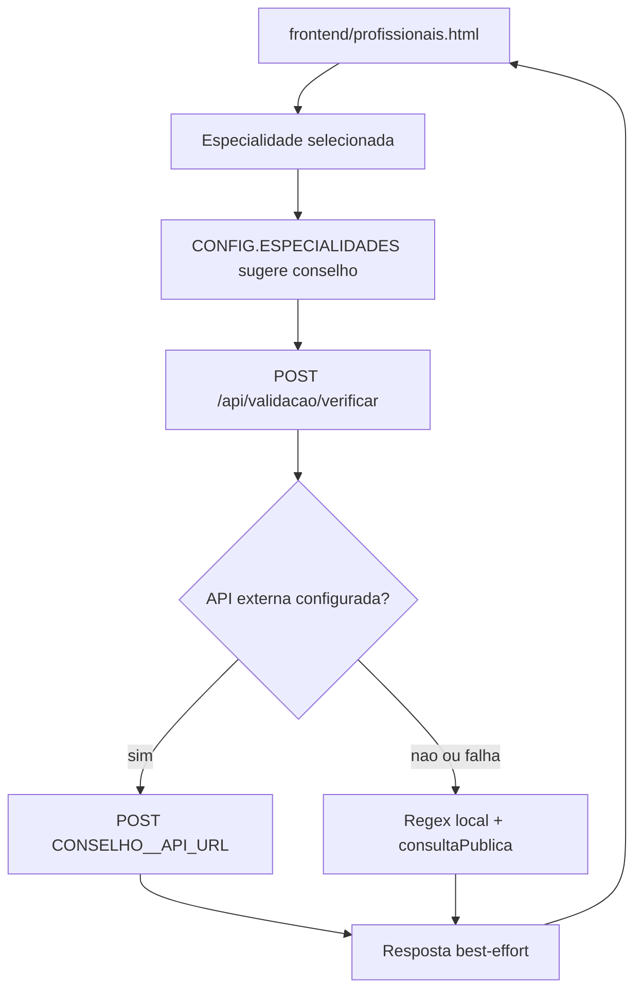

# Validacao de Conselhos Profissionais

## Objetivo

A validacao de conselhos profissionais apoia o cadastro e a auditoria de profissionais sem prometer uma verificacao oficial universal. Conselhos brasileiros nao oferecem um padrao REST publico unico; por isso o sistema usa um modelo best-effort:

1. valida formato local por conselho;
2. tenta API externa configurada por ambiente, quando existir;
3. retorna o link oficial de consulta publica para conferencia manual.

Esse desenho reduz cadastro incorreto e mantem transparencia sobre a fonte da validacao.

## Decisao Arquitetural

As regras de conselho ficam em `CONSELHOS_CONFIG` dentro de `backend/rotas/validacao-conselhos.js`. Cada conselho define:

- nome e site institucional;
- URL de consulta publica;
- variavel de ambiente opcional para API externa (`apiEnv`);
- regex de formato;
- se exige UF;
- especialidades vinculadas.

O endpoint publico usado no cadastro nao persiste dados. O endpoint autenticado valida compatibilidade entre especialidade e conselho, tenta validar e persiste historico em `validacoes_conselhos`.

## Fluxo de cadastro profissional



## Componentes

- `backend/rotas/validacao-conselhos.js`: configuracao dos conselhos, endpoints e cron de revalidacao.
- `frontend/profissionais.html`: chama `POST /api/validacao/verificar` durante o cadastro.
- `frontend/js/config.js`: mapeia especialidades para conselhos no frontend.
- `migracao-v2.1.sql`: cria `validacoes_conselhos` e colunas de apoio em `usuarios`.
- `backend/server.js`: monta `/api/validacao` e agenda `atualizarStatusValidacoes` todo dia as 03:00.

## Conselhos suportados

`CONSELHOS_CONFIG` cobre:

```text
ABRATH, CRM, CRP, CREFITO, COREN, CRO, CRN, CRF, CRBM, CRBIO, CREF, CFTO
```

Especialidades livres sem conselho obrigatorio:

```text
fitoterapia, ayurveda, mtc, yoga, xamanismo, jyotish, vastu,
florais-bach, apiterapia
```

## Endpoints

| Metodo | Rota | Auth | Uso |
| --- | --- | --- | --- |
| `GET` | `/api/validacao/conselhos` | Nao | Lista conselhos suportados e especialidades livres |
| `GET` | `/api/validacao/conselho/:especialidade` | Nao | Retorna conselho exigido para a especialidade, ou `null` quando livre |
| `POST` | `/api/validacao/verificar` | Nao | Valida `{ conselho, uf, numero, nome? }` durante cadastro |
| `POST` | `/api/validacao/validar-registro` | Sim | Valida registro do usuario autenticado e persiste historico |
| `GET` | `/api/validacao/status/:profissionalId` | Sim | Lista historico do proprio profissional ou, para admin, de outro profissional |

## Exemplos

### Descobrir conselho por especialidade

```bash
curl http://localhost:3000/api/validacao/conselho/massoterapia
```

Resposta esperada:

```json
{
  "conselho": "ABRATH",
  "nome": "Associação Brasileira de Terapeutas Holísticos",
  "site": "https://abrath.org.br",
  "consultaPublica": "https://abrath.org.br/area-do-terapeuta/",
  "formatoLabel": "5 a 8 dígitos",
  "requerUF": false
}
```

### Verificacao publica no cadastro

```bash
curl -X POST http://localhost:3000/api/validacao/verificar \
  -H "Content-Type: application/json" \
  -d '{
    "conselho": "ABRATH",
    "numero": "123456",
    "nome": "Ana Silva"
  }'
```

Quando nao ha API externa configurada, a resposta usa `fonte: "offline"`:

```json
{
  "conselho": "ABRATH",
  "conselhoNome": "Associação Brasileira de Terapeutas Holísticos",
  "valido": true,
  "fonte": "offline",
  "mensagem": "Formato válido para ABRATH. Consulta oficial disponível em https://abrath.org.br/area-do-terapeuta/.",
  "consultaPublica": "https://abrath.org.br/area-do-terapeuta/"
}
```

### Validacao autenticada e persistida

```bash
curl -X POST http://localhost:3000/api/validacao/validar-registro \
  -H "Content-Type: application/json" \
  -H "Authorization: Bearer <jwt>" \
  -d '{
    "especialidade": "massoterapia",
    "conselho": "ABRATH",
    "numero": "123456"
  }'
```

## APIs externas opcionais

Cada conselho pode ter uma URL externa configurada por variavel de ambiente. Exemplos:

```env
ABRATH_API_URL=https://...
CRM_API_URL=https://...
CRP_API_URL=https://...
CREFITO_API_URL=https://...
```

Contrato esperado da API externa:

- metodo `POST`;
- corpo enviado: `{ numero, uf, nome }`;
- timeout de 6 segundos;
- resposta com campo booleano `valido`.

Campos opcionais aceitos na resposta externa:

- `ativo`
- `profissional`
- `especialidades`
- `mensagem`

Se a API externa falhar, nao responder ou nao retornar `valido` booleano, o backend volta para a validacao offline de formato.

## Persistencia

`validar-registro` grava em `validacoes_conselhos` quando a persistencia esta disponivel:

| Coluna | Uso |
| --- | --- |
| `profissional_id` | ID do usuario autenticado |
| `conselho` | Sigla enviada |
| `numero_registro` | Numero validado |
| `status` | `valido` ou `invalido` conforme `resultado.valido` |
| `dados_validacao` | JSON completo da resposta |
| `criado_em` / `atualizado_em` | Auditoria temporal |

A migracao tambem adiciona em `usuarios`:

- `conselho_profissional`
- `numero_registro`
- `validacao_conselho_status`

## Cron de revalidacao

`backend/server.js` agenda `atualizarStatusValidacoes` todos os dias as 03:00. O job:

1. busca registros `status = 'valido'` criados nos ultimos 30 dias;
2. chama `validarConselho` novamente;
3. atualiza `dados_validacao` e `atualizado_em`.

Restricao operacional: a tabela atual nao guarda `uf`, mas alguns conselhos exigem UF. Para revalidacao confiavel desses conselhos, persista UF no historico ou ajuste o job para recuperar a UF de outra fonte antes de depender do resultado.

## Semantica de seguranca

- `valido: true` em `fonte: "offline"` significa apenas formato compativel, nao confirmacao oficial de registro ativo.
- O texto retornado sempre deve manter `consultaPublica` para conferencia manual.
- O cadastro pode usar a validacao como sinal de qualidade, mas a liberacao profissional depende das regras de negocio de onboarding e auditoria.
- Falhas de API externa nao devem bloquear o sistema quando houver validacao de formato; elas devem aparecer como fallback offline.

## Manutencao

Ao adicionar um conselho:

1. Incluir entrada em `CONSELHOS_CONFIG`.
2. Definir regex conservadora e `formatoLabel`.
3. Informar `consultaPublica` oficial.
4. Mapear especialidades correspondentes.
5. Atualizar `frontend/js/config.js` se a especialidade aparecer no cadastro.
6. Adicionar exemplo neste documento quando a regra impactar onboarding.
